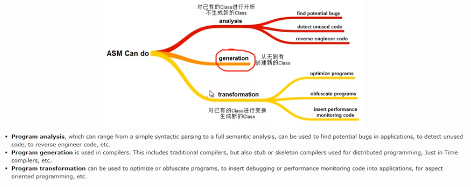

# ASM概述

ASM is an open source java library for manipulating java byte code

## ASM Core API
### 第一章 ASM 介绍
+ 1、ASM介绍
ASM是一个操作Java字节码的类库，为了更好的理解ASM,需要搞清楚两个问题，
第一个问题就是，ASM的操作对象是什么，ASM的操作对象是字节码数据ByteCode
一个.java文件经过Java编译器编译之后会生成一个.class文件，在.class文件中，存储的是字节码数据，字节码的具体表现形式就是.class文件
第二个问题就是：ASM如何处理字节码数据
 ASM处理字节码的方式是“拆分-修改-合并”
第一步，将.class文件拆分成多个部分，第二步，对某一个部分的信息进行修改，第三步：将多个部分重新组织成一个新的.class文件
ASM provides a simple API for decomposing,modifing ,and recomposing binary java classes (from Wikipedia)

ASM 并不是一些单词的首字母缩写，the ASM name does not mean anything :it is just a reference to the asm keyword in C ,which allows some functions
to be implemented in assembly language

ASM版本的发展
Java语言在不断地发展，ASM版本也需要不断地发展来跟上Java的发展
Java8 需要使用ASM5.0版本 Java11需要使用ASM7.0版本 尽可能使用更高的版本

+ 2、ASM组成部分
+ 3、ASM与ClassFile
+ 4、ClassFile快速参考
+ 5、如何编写ASM代码

### 第二章 生成新的类 从0到1 从无到有 生成
+ 1、ClassVisitor介绍
+ 2、ClassWriter介绍
+ 3、ClassWriter代码示例
+ 4、FieldVisitor介绍
+ 5、FieldWriter介绍
+ 6、MethodVisitor介绍
+ 7、MethodWriter介绍
+ 8、方法的初始Frame
+ 9、MethodVisitor代码示例
+ 10、Label介绍
+ 11、Label代码示例
+ 12、frame介绍
+ 13、Opcodes介绍
+

### 第三章 转换已有的类 class文件增强
+ 1、ClassReader介绍
+ 2、ClassReader代码示例
+ 3、Class Transformation的原理
+ 4、Type介绍
+ 5、修改已有的方法（添加-进入和退出）
+ 6、修改已有的方法（添加-进入和退出-打印方法参数和返回值）
+ 7、修改已有的方法（添加-进入和退出-方法计时）
+ 8、修改已有的方法（删除-移除Instruction）
+ 9、修改已有的方法（删除-清空方法体）
+ 10、修改已有的方法（修改-替换方法调用）
+ 11、查找已有的方法（查找-方法调用）
+ 12、修改已有的方法（优化-删除-去掉没有必要的Instruction)

### 工具类和常用类
+ 1、asm-util和asm-commons
+ 2、CheckClassAdapter介绍
+ 3、TraceClassVisitor介绍
+ 4、Printer/ASMifier/Textifier
+ 5、AdviceAdapter介绍
+ 6、GeneratorAdapter介绍
+ 7、LocalVariablesSorter介绍
+ 8、AnalyzerAdapter介绍
+ 9、InstructionAdapter介绍
+ 10、ClassRemapper介绍
+ 11、StaticInitMerger介绍
+ 12、SerialVersionUIDAdder介绍

参考：
[lsieun github主页](https://lsieun.github.io/)
[视频教程](https://space.bilibili.com/1321054247?spm_id_from=333.788.0.0)

