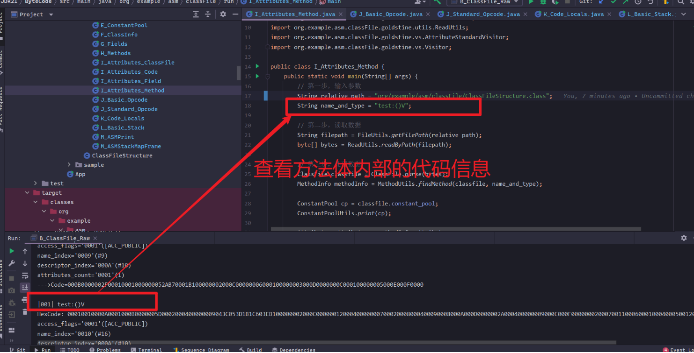

# ASM概述

ASM is an open source java library for manipulating java byte code

## ASM Core API
### 第一章 ASM 介绍
+ 1、ASM介绍
ASM是一个操作Java字节码的类库，为了更好的理解ASM,需要搞清楚两个问题，
第一个问题就是，ASM的操作对象是什么，ASM的操作对象是字节码数据ByteCode
一个.java文件经过Java编译器编译之后会生成一个.class文件，在.class文件中，存储的是字节码数据，字节码的具体表现形式就是.class文件
第二个问题就是：ASM如何处理字节码数据
 ASM处理字节码的方式是“拆分-修改-合并”
第一步，将.class文件拆分成多个部分，第二步，对某一个部分的信息进行修改，第三步：将多个部分重新组织成一个新的.class文件
ASM provides a simple API for decomposing,modifing ,and recomposing binary java classes (from Wikipedia)

ASM 并不是一些单词的首字母缩写，the ASM name does not mean anything :it is just a reference to the asm keyword in C ,which allows some functions
to be implemented in assembly language

ASM版本的发展
Java语言在不断地发展，ASM版本也需要不断地发展来跟上Java的发展
Java8 需要使用ASM5.0版本 Java11需要使用ASM7.0版本 尽可能使用更高的版本


**ASM的应用**:(1)asm应用于spring 动态代理 （2）jdk中的asm  lambda

+ 2、ASM组成部分    
从组成结构上来说，ASM分为两个部分 一部分为 Core API 另一部分为 Tree API    
其中Core API包括asm.jar  asm-util.jar asm-commons.jar
其中，Tree API包括asm-tree.jar和asm-analysis.jar    
从两者的关系来说，Core API是基础，TreeAPI是在Core API的基础上构建起来的    

Core API:

[1]asm.jar    
在asm.jar文件中，一共包含30多个类，只会介绍10个类，剩下的20多个类主要起到辅助的作用，主要的十个类：ClassVisitor ClassWriter  FieldVisitor  FieldWriter  MethodVisitor  MethodWriter Label  Opcodes    
对于修改已经存在的类，使之内容发生改变 其中会涉及到ClassReader  Type类     
最重要的类  ClassReader  ClassVisitor   ClassWriter类    
ClassReader:主要负责读取  .class文件类的内容 然后拆分为各个不同的部分    
ClassVisitor:负责.class文件的某一部分里的信息进行修改    
ClassWriter:负责将各个不同部分重新组合成一个完整的.class文件    

[2]asm-util.jar
主要包含一些工具类，这些类主要分成两种类型，Check开头和Trace开头

以Check开头的类，主要负责检查生成的.class文件内容是否正确    
以Trace开头的类，主要负责将.class文件 的内容打印成文字输出，根据输出的文字信息，可以探索或追踪Trace .class文件的内部信息    
在asm-util.jar当中，主要介绍CheckClassAdapter 和TraceClassVisitor 类， printer ASMifier  Textifier


+ 3、ASM与ClassFile

第一点：具体的.class文件遵循ClassFile的结构

第二点：操作字节码的类库有多个，ASM只是其中的一种，但是特点是执行速度快，占用空间小

第三点：ASM与ClassFile 之间的关系，形象地来说，ClassFile相当于树根，ASM相当于树根基础上的树干或者枝叶


+ 4、ClassFile快速参考
 Java ClassFile
对于一个具体的.class而言，它遵循ClassFile结构，这个数据结构位于[Java Virtual Machine Specification](https://docs.oracle.com/javase/specs/jvms/se8/html/index.html) 的[The class File format](https://docs.oracle.com/javase/specs/jvms/se8/html/jvms-4.html)部分
```
ClassFile {
    u4             magic;
    u2             minor_version;
    u2             major_version;
    u2             constant_pool_count;
    cp_info        constant_pool[constant_pool_count-1];
    u2             access_flags;
    u2             this_class;
    u2             super_class;
    u2             interfaces_count;
    u2             interfaces[interfaces_count];
    u2             fields_count;
    field_info     fields[fields_count];
    u2             methods_count;
    method_info    methods[methods_count];
    u2             attributes_count;
    attribute_info attributes[attributes_count];
}
```
其中：
+ u1:表示占用1个字节
+ u2:表示占用2个字节
+ u4:表示占用4个字节
+ u8:表示占用8个字节
cp_info、field_info、method_info、attribute_info表示较为复杂的结构，但是他们也是由u1、u2、u4和u8组成的
相应的，在.class文件当中，定义的字段，要遵循field_info结构

**ClassFile结构实例**    
[ClassFile实例仓库](https://gitee.com/lsieun/java8-classfile-tutorial)    
本仓库参考位置：org.example.asm.classFile.ClassFileStructure    


ClassFile 结构中的 field_info,在.class文件当中，定义的字段，要遵循field_info 结构    
```
field_info {
    u2             access_flags;
    u2             name_index;
    u2             descriptor_index;
    u2             attributes_count;
    attribute_info attributes[attributes_count];
}
```

同样的，.class中定义的方法，也要遵循method_info的结构    
```
method_info {
    u2             access_flags;
    u2             name_index;
    u2             descriptor_index;
    u2             attributes_count;
    attribute_info attributes[attributes_count];
}
```
在method_info 结构中，定义的方法体的代码，是存在于Code属性结构中的，结构如下所示：     
```
Code_attribute {
    u2 attribute_name_index;
    u4 attribute_length;
    u2 max_stack;
    u2 max_locals;
    u4 code_length;
    u1 code[code_length];
    u2 exception_table_length;
    {   u2 start_pc;
        u2 end_pc;
        u2 handler_pc;
        u2 catch_type;
    } exception_table[exception_table_length];
    u2 attributes_count;
    attribute_info attributes[attributes_count];
}
```
查看方法method_info内部的code_attribute 

查看method_info中的code信息 指令和局部变量表 org.example.asm.classFile.run.K_Code_Locals

+ 5、如何编写ASM代码

使用ASMPrint类将.class文件转换为ASM代码    


### 第二章 生成新的类 从0到1 从无到有 生成
+ 1、ClassVisitor介绍
ClassVisitor是一个抽象类，需要具体的子类来实现，比较常见的ClassVisitor有 ClassWriter (Core API)和ClassNode类（tree API）    
```java
public class ClassWriter extends ClassVisitor{
}
```
```java
public class ClassNode extends ClassVisitor{
    
}
```
ClassVisitor定义的字段：    
```java
public abstract class ClassVisitor {
    protected final int api;
    protected ClassVisitor cv;
}
```
api字段：它是一个int类型的数据，指出了当前使用的ASM api版本，其取值有Opcodes.ASM4 Opcodes.ASM5 Opcodes.ASM6 Opcodes.ASM7 Opcodes.ASM8 Opcodes.ASM9,我们使用的是ASM9 所以选择Opcodes.ASM9就行了    
cv字段：他是一个ClassVisitor类型的数据，他的作用是将多个ClassVisitor串联起来    

constructor字段：    
```java
public abstract class ClassVisitor {
    public ClassVisitor(final int api) {
        this(api, null);
    }

    public ClassVisitor(final int api, final ClassVisitor classVisitor) {
        this.api = api;
        this.cv = classVisitor;
    }
}
```
ClassVistor method:    

第四个部分，ClassVisitor 类定义的方法有哪些。在 ASM 当中，使用到了 Visitor Pattern（访问者模式），所以 ClassVisitor 当中许多的 visitXxx() 方法。

虽然，在 ClassVisitor 类当中，有许多 visitXxx() 方法，但是，我们只需要关注这 4 个方法：visit()、visitField()、visitMethod() 和 visitEnd()。

为什么只关注这 4 个方法呢？因为这 4 个方法是 ClassVisitor 类的精髓或骨架，在这个“骨架”的基础上，其它的 visitXxx() 都容易扩展；同时，将 visitXxx() 方法缩减至 4 个，也能减少学习过程中的认知负担，学起来更容易。
```java
public abstract class ClassVisitor {
    public void visit(
        final int version,
        final int access,
        final String name,
        final String signature,
        final String superName,
        final String[] interfaces);
    public FieldVisitor visitField( // 访问字段
        final int access,
        final String name,
        final String descriptor,
        final String signature,
        final Object value);
    public MethodVisitor visitMethod( // 访问方法
        final int access,
        final String name,
        final String descriptor,
        final String signature,
        final String[] exceptions);
    public void visitEnd();
    // ......
}
```
在 ClassVisitor 的 visit() 方法、visitField() 方法和 visitMethod() 方法中都带有 signature 参数。这个 signature 参数与“泛型”密切相关；换句话说，如果处理的是一个带有泛型信息的类、字段或方法，那么就需要给 signature 参数提供一定的值；如果处理的类、字段或方法不带有“泛型”信息，那么将 signature 参数设置为 null 就可以了。在本次课程当中，我们不去考虑“泛型”相关的内容，所以我们都将 signature 参数设置成 null 值。

如果大家对 signature 参数感兴趣，我们可以使用之前介绍的 PrintASMCodeCore 类去打印一下某个泛型类的 ASM 代码。例如，java.lang.Comparable 是一个泛型接口，我们就可以使用 PrintASMCodeCore 类来打印一下它的 ASM 代码，从来查看 signature 参数的值是什么。    

ClassVisitor方法的调用顺序：    
在 ClassVisitor 类当中，定义了多个 visitXxx() 方法。这些 visitXxx() 方法，遵循一定的调用顺序（可参考 API 文档）：    
```
visit
[visitSource][visitModule][visitNestHost][visitPermittedSubclass][visitOuterClass]
(
 visitAnnotation |
 visitTypeAnnotation |
 visitAttribute
)*
(
 visitNestMember |
 visitInnerClass |
 visitRecordComponent |
 visitField |
 visitMethod
)* 
visitEnd
```
其中，涉及到一些符号，它们的含义如下：

[]: 表示最多调用一次，可以不调用，但最多调用一次。    
() 和 |: 表示在多个方法之间，可以选择任意一个，并且多个方法之间不分前后顺序。    
*: 表示方法可以调用 0 次或多次。    

我们只关注 ClassVisitor 类当中的 visit() 方法、visitField() 方法、visitMethod() 方法和 visitEnd() 方法这 4 个方法，所以上面的方法调用顺序可以简化如下：    
```
visit
(
 visitField |
 visitMethod
)* 
visitEnd
```
也就是说，先调用 visit() 方法，接着调用 visitField() 方法或 visitMethod() 方法，最后调用 visitEnd() 方法。     

visitXxx() 方法与 ClassFile:     

ClassVisitor 的 visitXxx() 方法与 ClassFile 之间存在对应关系：

ClassVisitor.visitXxx() --- .class --- ClassFile
在 ClassVisitor 中定义的 visitXxx() 方法，并不是凭空产生的，这些方法存在的目的就是为了生成一个合法的 .class 文件，而这个 .class 文件要符合 ClassFile 的结构，所以这些 visitXxx() 方法与 ClassFile 的结构密切相关。

visit()方法：
```
public void visit(
    final int version,
    final int access,
    final String name,
    final String signature,
    final String superName,
    final String[] interfaces);
```
对比visit方法与ClassFIle结构之间的关系：    
```
ClassFile {
    u4             magic;
    u2             minor_version;
    u2             major_version;
    u2             constant_pool_count;
    cp_info        constant_pool[constant_pool_count-1];
    u2             access_flags;
    u2             this_class;
    u2             super_class;
    u2             interfaces_count;
    u2             interfaces[interfaces_count];
    u2             fields_count;
    field_info     fields[fields_count];
    u2             methods_count;
    method_info    methods[methods_count];
    u2             attributes_count;
    attribute_info attributes[attributes_count];
}
```

visitField() 方法：    
```
public FieldVisitor visitField( // 访问字段
    final int access,
    final String name,
    final String descriptor,
    final String signature,
    final Object value);
```
```
field_info {
    u2             access_flags;
    u2             name_index;
    u2             descriptor_index;
    u2             attributes_count;
    attribute_info attributes[attributes_count];
}
```

visitMethod() 方法:    
```
public MethodVisitor visitMethod( // 访问方法
    final int access,
    final String name,
    final String descriptor,
    final String signature,
    final String[] exceptions);
```
```
method_info {
    u2             access_flags;
    u2             name_index;
    u2             descriptor_index;
    u2             attributes_count;
    attribute_info attributes[attributes_count];
}
```
visitEnd() 方法 :    
visitEnd() 方法，它是这些 visitXxx() 方法当中最后一个调用的方法。

为什么 visitEnd() 方法是“最后一个调用的方法”呢？是因为在 ClassVisitor 当中，定义了多个 visitXxx() 方法，这些个 visitXxx() 方法之间要遵循一个先后调用的顺序，而 visitEnd() 方法是最后才去调用的。

等到 visitEnd() 方法调用之后，就表示说再也不去调用其它的 visitXxx() 方法了，所有的“工作”已经做完了，到了要结束的时候了。
```
/*
 * Visits the end of the class.
 * This method, which is the last one to be called,
 * is used to inform the visitor that all the fields and methods of the class have been visited.
 */
public void visitEnd() {
    if (cv != null) {
        cv.visitEnd();
    }
}
```


+ 2、ClassWriter介绍


+ 3、ClassWriter代码示例


+ 4、FieldVisitor介绍


+ 5、FieldWriter介绍


+ 6、MethodVisitor介绍


+ 7、MethodWriter介绍


+ 8、方法的初始Frame
  JVM Architecture由 Class Loader SubSystem,Runtime Data Areas和 Execution Engine三个部分组成 ，其中Runtime Data Areas包括Method Area 、Heap Area 、stack area 、PC Register和Native Method Stack等部分
在程序运行的过程中，每个线程Thread 都对应都对应一个属于自己的JVM Stack当一个新线程开始的时候，就会在内存上分配一个属于自己的JVM Stack；当该线程执行结束的时候，相应JVM Stack内存空间也就被回收了
在JVM Stack 当中，存储的是stack frame,当调用一个新方法的时候，就会在JVM Stack上分配一个frame空间，入栈操作，当方法退出时，相应frame空间也会JVM Stack上进行清除，出栈操作
在Stack Frame内存空间中，有两个重要的结构，即Local Variables 和operand stack，都会有一个开始状态和结束状态

operand stack是一个栈结构
local variables是一个数组
对于每一个方法来说，都是在自己的stack frame上来运行的
在编译的时候(compile time),local variables和 operand stack的空间大小就确定下来了，比如，一个.java文件经过编译之后，得到一个.class文件，对于其中的某一个方法来说，它的local variable占用10个slot空间 operand stack占用4个slot空间

在运行的时候，在local variables和operand stack上存放的数据会随着方法的执行不断发生变化

方法的初始化栈帧 ，operand stack是空的，不需要存储任何数据，而local variables的初始状态，则需要考虑两个因素
 是否需要存储this,通过判断方法是否为static,如果方法是static，则不需要存储this，如果当前方法是non-static的，则需要在local variables索引为0的位置存在一个this变量
 当前方法是和否接受参数，方法接收的参数，会按照声明的顺序放到local variables中，如果方法参数不是long double类型，那么它在local variable当中占用1个位置
 如果当前方法的参数是long double类型 那么它在local variable当中占用2个位置
  
+ 9、MethodVisitor代码示例


+ 10、label介绍

程序设计中，有三种基本控制结构：顺序 选择 和循环，在bytecode层面，只存在两种 顺序（sequence）和跳转（jump）两种指令执行顺序 instruction
  那么ASM中的label类的作用是什么？MethodVisitor类是用于生成方法体的代码，如果没有label类的参与，那么MethodVisitor类只能生成顺序结构的代码，如果有label类的参与，那么MethodVisitor类就能生成选择和循环结构的代码
  
+ 11、Label代码示例
 通过ASM生成.class文件  
通过ASM生成HelloWorldNext.java对应的字节码，其中目标.class如下所示。HelloWorldNext.java---->HelloWorldNext.class  

首先对FileUtils使用，在target/classes目录下生成.class文件  

定义相对路径，比如文件夹samples下生成HelloWorldNext.class   String relative_path="samples/HelloWorldNext.class"  

获取编译之后的绝对路径。 String filePath = FileUtils.getFilePath(relative_path);  

获取 asm生成的字节码文件 byte[] 通过FileUtils.writeBytes(filePath,bytes);将byte[]数组写入对应的路径 
[filePath](/Users/liulei318/Documents/goldstine_workspace/coding/Github/learn-java-asm/target/classes/sample/HelloWorldNext.class)
[写入byte数组](file:///Users/liulei318/Documents/goldstine_workspace/coding/Github/learn-java-asm/target/classes/sample/HelloWorldNext.class)
 
```
public static byte[] dump() throws Exception{
  //获取字节码输出asm ClassWriter
  ClassWriter classWriter=new ClassWriter(ClassWriter.COMPUTE_FRAMES);
  //定义classWriter对应的属性，classFile版本 访问标志accessFlag 等
  classWriter.visit(V1_8,ACC_PUBLIC+ACC_SUPER,"sample/HelloWorldNext",null,"java/lang/Object",null);
  {
    // 获取MethodVisitor对象，首先获取构造方法的字节码
    MethodVisitor mv1 = classWriter.visitMethod(ACC_PUBLIC,"<init>","()V",null,null);
    mv1.visitCode();
    mv1.visitVarInsn(ALOAD,0);
    mv1.visitMethodInsn(INVOKESPECIAL,"java/lang/Object","<init>","()V",false);
    mv1.visitInsn(RETURN);
    mv1.visitMaxs(0,0);

    mv1.visitEnd();
     
  }
  {
    MethodVisitor mv2 = classWriter.visitMethod(ACC_PUBLIC, "test", "(I)V", null, null);
            Label elseLabel = new Label();
            Label returnLabel = new Label();

            mv2.visitCode();
            mv2.visitVarInsn(ILOAD,1);
            mv2.visitJumpInsn(IFNE,elseLabel);
            mv2.visitFieldInsn(GETSTATIC, "java/lang/System", "out", "Ljava/io/PrintStream;");
            mv2.visitLdcInsn("value is 0");
            mv2.visitMethodInsn(INVOKEVIRTUAL, "java/io/PrintStream", "println", "(Ljava/lang/String;)V", false);
            mv2.visitJumpInsn(GOTO, returnLabel);


            mv2.visitLabel(elseLabel);
            mv2.visitFieldInsn(GETSTATIC, "java/lang/System", "out", "Ljava/io/PrintStream;");
            mv2.visitLdcInsn("value is not 0");
            mv2.visitMethodInsn(INVOKEVIRTUAL, "java/io/PrintStream", "println", "(Ljava/lang/String;)V", false);

            // 第 3 段
            mv2.visitLabel(returnLabel);
            mv2.visitInsn(RETURN);   
            mv2.visitMaxs(0, 0);       // 其中 visitCode()  visitMaxs()   visitEnd()仅执行一次，标志着方法字节码访问的开始和结束
            mv2.visitEnd();
  }
 classWriter.visitEnd();
        return classWriter.toByteArray();
}
```
常用api：    
visitFieldLnsn:访问 某个成员变量的指令，支持GETSTATIC,PUTSTATIC,GETFIELD,PUTFIELD    
visitFrame: 访问当前局部变量表和操作数栈中元素的状态，参数就是局部变量表和操作数栈的内容    
visitlinclnsn: 访问自增指令    
visitVarLnsn:访问局部变量指令，就是取局部变量的值放入操作数栈   操作码是ILOAD   LLOAD  FLOAD DLOAD ALOAD  ISTORE  FSTORE DSTOER ASTORE or RET    
visitMethodlnsn:访问方法指令，就是调用某个方法，支持INVOKEVIRTUAL,INVOKESPECIAL INVOKESTATIC INVOKEINTERFACE    
visitlnsn:访问无操作数的指令，例如 nop duo等等    
visitTypelnsn:访问type指令，即将一个类的全限定名作为参数然后new一个对象压入操作数栈中    

参考：    
[ASM指南｜计算机技术实践](https://mwping.github.io/android/asm.html)    
[ASM code](https://github.com/AndroidAdvanceWithGeektime/Chapter-ASM/blob/master/asm-gradle-plugin/src/main/java/com/geektime/asm/ASMCode.java)    
[ASM使用](https://www.cnblogs.com/tr1ple/p/12800859.html)    
[局部变量表和操作数栈](https://juejin.cn/post/6844903693553238023)    
[ASM](https://blog.csdn.net/it_freshman/article/details/81156106)    
[ASM api](https://cloud.tencent.com/developer/article/1633443)    
[ASM接口、方法、组件](https://www.innereye.cn/2016/09/26/asm/4/Manual_ASM_3.2_Method_Interfaces_And_Components/)    
[ASM字节码操作类库(打开java语言世界通往字节码世界的大门](https://developer.jdcloud.com/article/3435)    
[B站相关](https://www.bilibili.com/read/cv13433468/)    

+ 12、frame介绍
+ 13、Opcodes介绍
+


### 第三章 转换已有的类 class文件增强
+ 1、ClassReader介绍
+ 2、ClassReader代码示例
+ 3、Class Transformation的原理
+ 4、Type介绍
+ 5、修改已有的方法（添加-进入和退出）
+ 6、修改已有的方法（添加-进入和退出-打印方法参数和返回值）
+ 7、修改已有的方法（添加-进入和退出-方法计时）
+ 8、修改已有的方法（删除-移除Instruction）
+ 9、修改已有的方法（删除-清空方法体）
+ 10、修改已有的方法（修改-替换方法调用）
+ 11、查找已有的方法（查找-方法调用）
+ 12、修改已有的方法（优化-删除-去掉没有必要的Instruction)


### 工具类和常用类
+ 1、asm-util和asm-commons   
  在asm-util中，主要介绍CheckClassAdapter和TraceClassVisitor类，在TraceClassVisitor类当中，会涉及到Printer，ASMifier和Textifier类
｜asm-util｜CheckClassAdapter
          ｜TraceClassVisitor|printer:ASMifier、Textifier
            PrinterWriter
 其中，CheckClassAdapter类，主要负责检查(Check)生成的.class文件内容是否正确
其中，TraceClassVisitor类，主要负责将.class文件的内容打印成文字输出，根据输出的文字信息，可以探索或追踪（Trace）.class文件内部的信息

在ams-commons.jar中，包括的类比较多，主要可以分为两组ClassVisitor的子类，另一组是MethodVisitor的子类
+ 其中，ClassVisitor的子类有 ClassRemapper   StaticInitMerger  和 SerialVersionUIDAdder类
+ MethodVisitor的子类有LocalVariableSorter  GeneratorAdapter   AdviceAdapter  AnalyzerAdapter   和 InstructionAdapter类

asm-commons.jar和asm-util的区别，
asm-util.jar提供的是通用性的功能，没有特别明确的使用场景，而在asm-commons.jar里，它提供的功能，都是为解决某一种特定场景中出现的问题而提出的解决思路
asm-util.jar 和asm-commons.jar两者都对asm.jar  asm-tree.jar asm-analysis.jar有依赖

> asm.jar  和 asm-util.jar的使用
> 通过asm.jar和asm-util.jar输出现有.java文件的 asm 生成.class的代码文件[asmifier的使用](https://blog.csdn.net/yizhizouxiaqu/article/details/7636884)
  
+ 2、CheckClassAdapter介绍
+ 3、TraceClassVisitor介绍
+ 4、Printer/ASMifier/Textifier
+ 5、AdviceAdapter介绍
+ 6、GeneratorAdapter介绍
+ 7、LocalVariablesSorter介绍
+ 8、AnalyzerAdapter介绍
+ 9、InstructionAdapter介绍
+ 10、ClassRemapper介绍
+ 11、StaticInitMerger介绍
+ 12、SerialVersionUIDAdder介绍


参考：
[lsieun github主页](https://lsieun.github.io/)
[视频教程](https://space.bilibili.com/1321054247?spm_id_from=333.788.0.0)


